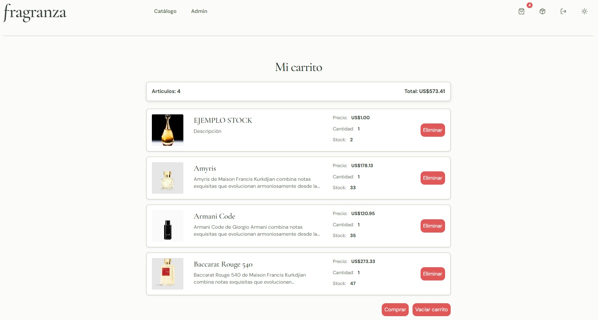
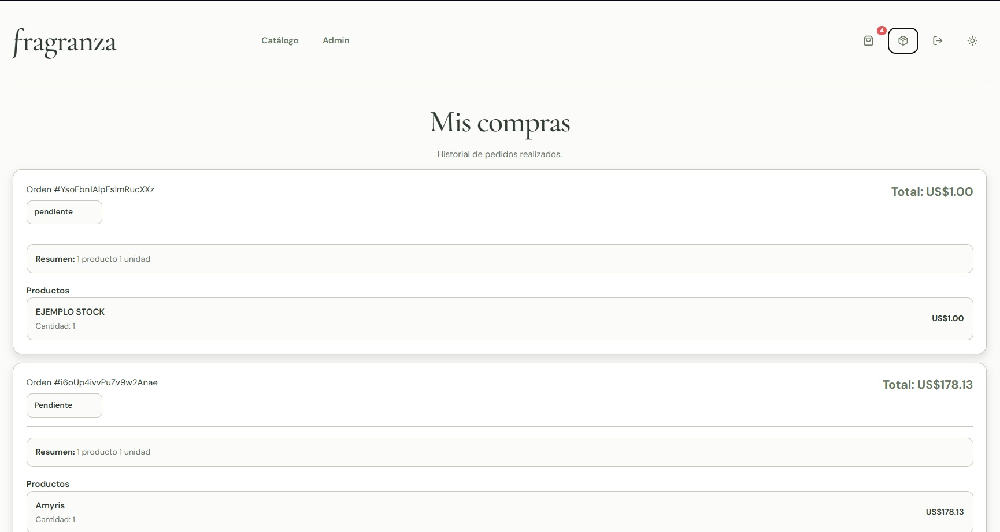
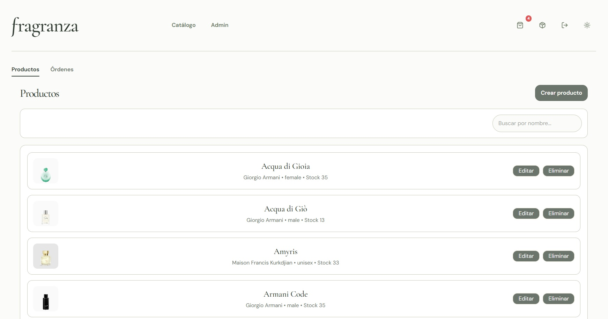
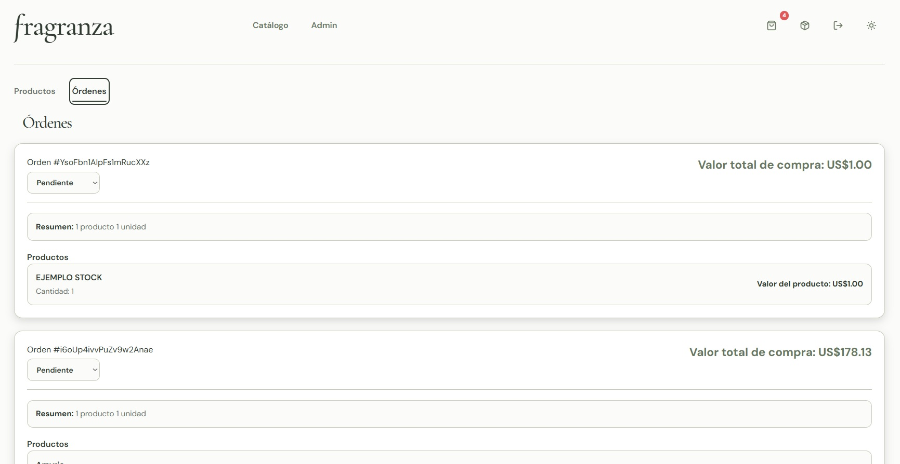

# Proyecto M5

## Índice

- [1. ¿Qué hace mi app?](#1-qué-hace-mi-app)
- [2. Arquitectura del proyecto](#2-arquitectura-del-proyecto)
- [3. Firebase](#3-firebase)
- [4. AWS para imágenes](#4-aws-para-imágenes)
- [5. Tests realizados](#5-tests-realizados)
- [6. Ejecución local](#6-ejecución-local)
- [7. Deploy en Vercel](#7-deploy-en-vercel)
- [8. Documentación con IA](#8-documentación-con-ia)

---

## 1. ¿Qué hace mi app?

Esta aplicación es un ecommerce especializado en la venta de perfumes, desarrollado con el objetivo de ofrecer una experiencia de compra completa, intuitiva y segura para los usuarios.

La plataforma permite navegar por el catálogo de productos sin necesidad de estar registrado, pudiendo visualizar perfumes y consultar sus detalles. Para realizar compras, los usuarios deben contar con una cuenta e iniciar sesión mediante email/contraseña o utilizando autenticación con Google Popup.

El sistema cuenta con diferentes roles de acceso:

- **Usuario:** puede explorar el catálogo, consultar detalles de productos, agregar perfumes al carrito, realizar compras y visualizar su historial de órdenes.
- **Administrador:** cuenta con acceso a un panel de administración donde puede gestionar los productos (crear, modificar y administrar el catálogo), además de visualizar y gestionar las órdenes realizadas por todos los usuarios.

Entre sus principales funcionalidades se encuentran:

- Registro e inicio de sesión de usuarios.
- Autenticación mediante Google Popup.
- Sistema de roles con permisos diferenciados entre usuarios y administradores.
- Navegación del catálogo sin necesidad de autenticación.
- Restricción de compra para usuarios no registrados.
- Visualización de productos y detalles de cada perfume.
- Gestión del carrito de compras.
- Creación y consulta del historial de órdenes.
- Panel administrativo para gestión de productos.
- Visualización y administración de órdenes generales.
- Gestión de imágenes y recursos asociados a los productos.

La aplicación busca simular una tienda online real, integrando servicios externos para autenticación, almacenamiento de información, gestión de recursos y control de acceso según el tipo de usuario.

### Vista general de la aplicación






[⬆️ Volver al inicio](#índice)

---

## 2. Arquitectura del proyecto

El proyecto está organizado siguiendo una estructura modular, separando responsabilidades entre componentes visuales, lógica de negocio, servicios externos y configuración general de la aplicación.

La arquitectura principal se divide en una API auxiliar, scripts de carga inicial y la carpeta `src`, donde se encuentra la aplicación frontend.
```
ProyectoM5
│
├── api
├── scripts
│ └── seed.ts
│
└── src
├── assets
├── components
├── contexts
├── pages
├── routes
├── services
├── styles
├── test
├── types
├── ui
├── utils
├── App.tsx
├── AppProviders.tsx
└── main.tsx
```
### Descripción de la estructura del proyecto

| Carpeta / Archivo | Descripción |
|-------------------|-------------|
| `api` | Contiene la API auxiliar del proyecto. Incluye el endpoint `presign`, utilizado para generar la firma necesaria para la subida de imágenes hacia AWS. |
| `scripts` | Contiene scripts de utilidad. El archivo `seed.ts` se encarga de cargar los productos iniciales en Firebase. |
| `src/assets` | Contiene recursos estáticos utilizados por la aplicación. |
| `src/components` | Componentes reutilizables de interfaz, como formularios, header y otros elementos compartidos entre distintas vistas. |
| `src/contexts` | Maneja los estados globales de la aplicación mediante Context API, como la autenticación y la información del usuario actual. |
| `src/pages` | Contiene las páginas principales de la aplicación, centralizando las diferentes vistas del ecommerce. |
| `src/routes` | Gestiona la navegación y las rutas públicas/protegidas, controlando el acceso según autenticación y roles de usuario. |
| `src/services` | Centraliza la comunicación con servicios externos como Firebase y la API utilizada para la integración con AWS. |
| `src/styles` | Contiene los estilos globales y la configuración del tema visual de la aplicación. |
| `src/test` | Incluye los tests realizados para validar el funcionamiento de diferentes funcionalidades. |
| `src/types` | Contiene definiciones de tipos reutilizables para mantener una estructura consistente en la aplicación. |
| `src/ui` | Contiene componentes pequeños y reutilizables de interfaz. |
| `src/utils` | Agrupa funciones auxiliares utilizadas en diferentes partes de la aplicación. |
| `App.tsx` | Contiene la estructura principal de la aplicación y la composición de sus componentes. |
| `AppProviders.tsx` | Agrupa los providers globales utilizados por la aplicación, como el proveedor de autenticación. |
| `main.tsx` | Punto de entrada de la aplicación, donde se inicializa React y se monta la configuración global mediante los providers. |
### Estructura general


[⬆️ Volver al inicio](#índice)

---

## 3. Firebase

Firebase es uno de los servicios principales utilizados en la aplicación, encargado tanto de la autenticación de usuarios como del almacenamiento y gestión de la información del ecommerce.

### Authentication

Firebase Authentication se utiliza para gestionar el acceso de los usuarios a la plataforma.

Permite:

- Registro e inicio de sesión mediante email y contraseña.
- Inicio de sesión mediante Google Popup.
- Manejo del estado de sesión del usuario.
- Funcionalidades de login y logout.
- Identificación del usuario para aplicar permisos según su rol.

La autenticación se integra con el sistema de roles de la aplicación, permitiendo diferenciar entre usuarios regulares y administradores.

### Firestore Database

Firebase Firestore se utiliza como base de datos principal para almacenar la información dinámica de la aplicación.

Dentro de la base de datos se gestionan:

- **Usuarios:** información de perfil, datos asociados y rol asignado dentro de la aplicación.
- **Productos:** catálogo completo de perfumes disponibles en la tienda.
- **Carritos:** productos agregados por cada usuario, asociados a su cuenta.
- **Órdenes:** registro de compras realizadas, permitiendo a cada usuario consultar su historial y al administrador visualizar las órdenes generales.

La estructura de Firestore permite relacionar la información entre usuarios, productos y órdenes, manteniendo organizada la información necesaria para el funcionamiento del ecommerce.

### Integración dentro de la aplicación

Firebase se conecta con la aplicación mediante la capa de servicios, donde se centralizan las operaciones de autenticación y consultas a la base de datos.

De esta forma, Firebase permite manejar la persistencia de datos, la autenticación segura de usuarios y la gestión de información necesaria para el funcionamiento de la tienda.

[⬆️ Volver al inicio](#índice)

---

## 4. AWS para imágenes

AWS se utiliza en el proyecto para la gestión y almacenamiento de las imágenes asociadas a los productos del ecommerce.

Se creó un bucket en AWS S3 donde se almacenan las imágenes de los perfumes. Este servicio permite que los administradores puedan cargar y actualizar imágenes al momento de crear o modificar productos desde el panel administrativo.

### Flujo de gestión de imágenes

El proceso de carga de imágenes funciona mediante la comunicación entre diferentes capas de la aplicación:

1. El administrador selecciona o actualiza la imagen de un producto desde el panel de administración.
2. El frontend realiza una solicitud hacia el BFF (Backend For Frontend).
3. El BFF se comunica con AWS mediante un endpoint `presign`, encargado de generar una URL firmada temporal.
4. Utilizando esa URL, la imagen se sube directamente al bucket de AWS S3.
5. La referencia de la imagen queda asociada al producto almacenado en Firebase.

### Integración dentro de la aplicación

AWS permite separar la gestión de archivos multimedia de la base de datos principal, manteniendo las imágenes almacenadas en un servicio especializado.

Este servicio es utilizado principalmente en el panel administrativo, donde los usuarios con rol administrador pueden crear y editar productos, incluyendo la carga y actualización de sus imágenes.

[⬆️ Volver al inicio](#índice)

---

## 5. Tests realizados

Para validar el correcto funcionamiento de la aplicación se realizaron pruebas unitarias y de integración utilizando **Vitest** y herramientas de testing para React.

Los tests están enfocados en comprobar la lógica principal del ecommerce, validando el comportamiento de estados, servicios y flujos importantes de la aplicación.

### Cobertura de pruebas

- **Carrito de compras**
  - Validación de agregado de productos al carrito.
  - Incremento de cantidad al agregar un mismo producto nuevamente.
  - Separación de carritos según el usuario autenticado.
  - Eliminación de productos.
  - Limpieza del carrito de un usuario específico.
  - Cálculo correcto de cantidad de productos y precio total.

- **Gestión de órdenes**
  - Creación de órdenes a partir de productos seleccionados.
  - Generación de órdenes desde los elementos del carrito.
  - Obtención de todas las órdenes ordenadas por fecha.
  - Consulta de órdenes filtradas por usuario.
  - Simulación de operaciones con Firebase Firestore mediante mocks para evitar utilizar una base de datos real durante las pruebas.

- **Carga de imágenes con AWS**
  - Validación del flujo de subida de imágenes mediante el servicio de presigned URL.
  - Verificación del correcto manejo de errores al generar la URL firmada.
  - Validación de errores durante la subida hacia S3.
  - Simulación de peticiones HTTP utilizando Mock Service Worker (MSW).

- **Hooks y contexto del carrito**
  - Validación del funcionamiento del hook `useCart`.
  - Comprobación del estado inicial del carrito.
  - Agregado y eliminación de productos mediante interacción del usuario.
  - Verificación de actualización de cantidades y totales.

### Herramientas utilizadas

- **Vitest:** framework utilizado para ejecutar las pruebas.
- **Testing Library:** utilizada para validar el comportamiento de componentes y hooks de React.
- **MSW (Mock Service Worker):** utilizada para simular solicitudes HTTP externas sin depender de servicios reales.

[⬆️ Volver al inicio](#índice)

---

## 6. Ejecución local

Para ejecutar el proyecto de manera local se deben seguir los siguientes pasos:

### 1. Clonar el repositorio

```bash
git clone URL_DEL_REPOSITORIO
```
2. Ingresar a la carpeta del proyecto

```
cd nombre-del-proyecto
```
3. Instalar las dependencias
```
npm install
```
4. Configurar variables de entorno

Crear un archivo .env en la raíz del proyecto y agregar las variables necesarias para la conexión con los servicios externos utilizados por la aplicación.

Ejemplo:

## Firebase
VITE_FIREBASE_API_KEY=
VITE_FIREBASE_AUTH_DOMAIN=
VITE_FIREBASE_PROJECT_ID=
...

## AWS / API
VITE_API_URL=

5. Ejecutar la aplicación en modo desarrollo
```
npm run dev
```
La aplicación estará disponible en la URL proporcionada por Vite, normalmente:

http://localhost:5173

Comandos adicionales

Ejecutar los tests:
```
npm run test
```

Ejecutar los tests en modo visual:
```
npm run test:ui
```
### 6. Cargar datos iniciales

Ejecutar el seed para agregar los productos iniciales a Firebase:

```bash
npm run seed
```

[⬆️ Volver al inicio](#índice)

---

## 7. Deploy en Vercel

La aplicación se encuentra desplegada utilizando Vercel, una plataforma de hosting optimizada para proyectos frontend.

### Configuración del deploy

Para realizar el despliegue se deben seguir los siguientes pasos:

1. Conectar el repositorio del proyecto con Vercel.
2. Seleccionar el framework utilizado (Vite).
3. Configurar las variables de entorno necesarias desde el panel de Vercel.
4. Realizar el deploy automático desde la rama principal del repositorio.

### Configuración utilizada

- **Framework:** Vite
- **Build Command:**

```bash
npm run build
```

Las variables de entorno utilizadas en desarrollo también deben estar configuradas dentro de Vercel para permitir la conexión con Firebase y los servicios externos utilizados por la aplicación.

Una vez configurado, cada actualización realizada en el repositorio puede generar un nuevo despliegue automático.

[⬆️ Volver al inicio](#índice)

---


## 8. Documentación con IA

Durante el desarrollo del proyecto se utilizó inteligencia artificial como herramienta de apoyo para diferentes tareas, incluyendo asistencia en documentación, revisión de código, resolución de errores y mejora de la estructura del proyecto.

La documentación detallada sobre el uso de IA, los prompts utilizados y las tareas en las que se aplicó se encuentra en el siguiente archivo:

📄 [Ver documentación de IA](./DOCIA.md)

[⬆️ Volver al inicio](#índice)